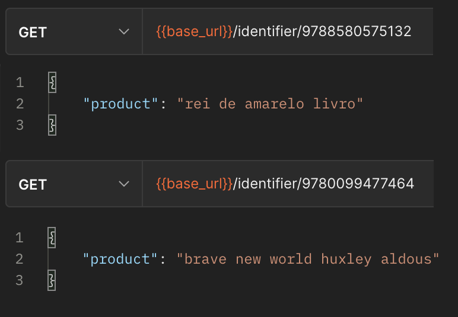

# Simple Barcode Identifier
## (deprecated)

Serverless API that identifies product names by barcode using the Google Search API.

### Example

### Test endpoint
Brave New World - Aldous Huxley
  - [Barcode: 9780099477464](https://xc3c9rhhqb.execute-api.eu-west-1.amazonaws.com/dev/identifier/9780099477464)

### Tools and technologies
  - Github Actions
  - Nodejs
  - Typescript
  - Jest
  - Aws Lambda Functions
  - Google Search Api
